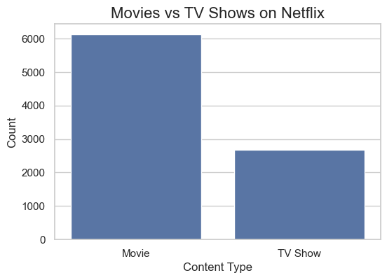
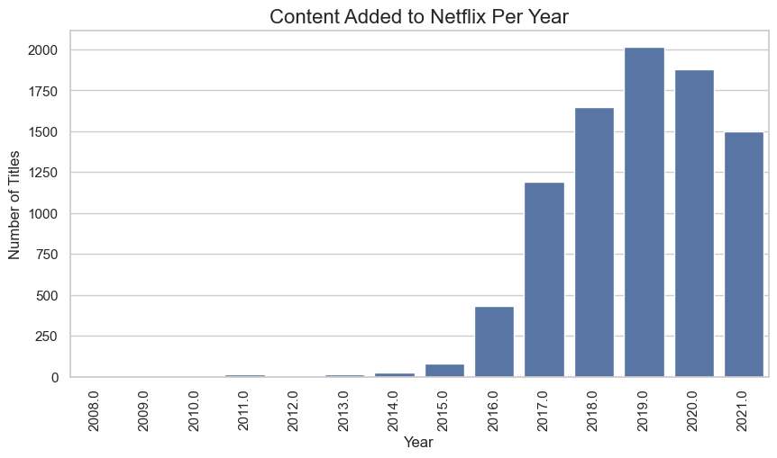
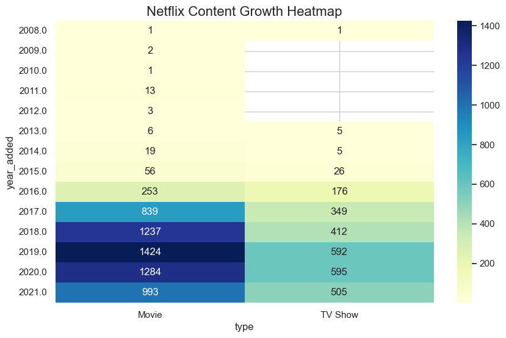
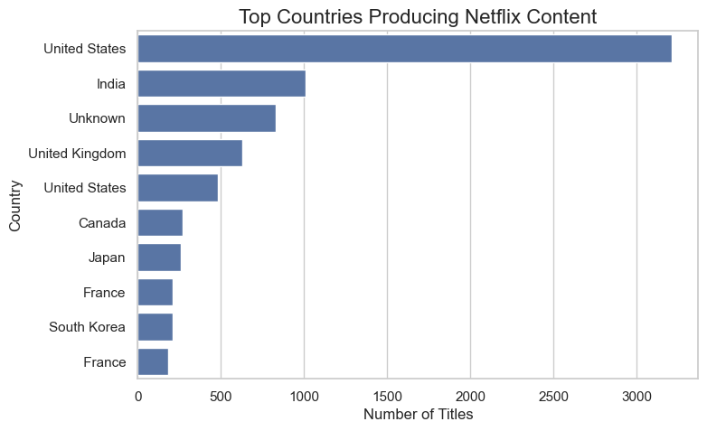
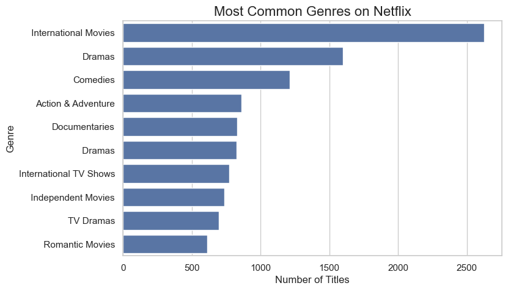

# Netflix EDA Analysis

## Overview
This project performs exploratory data analysis (EDA) on the Netflix
Movies and TV Shows dataset from Kaggle.

The goal is to analyze trends in Netflix's content library including:

- content growth over time
- geographic distribution
- genre popularity
- movie duration trends

## Dataset
Netflix Movies and TV Shows  
https://www.kaggle.com/datasets/shivamb/netflix-shows

## Tools
Python  
Pandas  
Seaborn  
Matplotlib  
Plotly

## Project Structure
netflix-eda-analysis/
│
├── notebook/
│   netflix_eda.ipynb
├── data/
│   netflix_titles.csv
├── images/
│   charts/
├── README.md
└── requirements.txt

## Key Visualizations

### Movies vs TV Shows

### Netflix Content Growth

### Content Growth Heatmap

### Top Countries

### Top Genres
